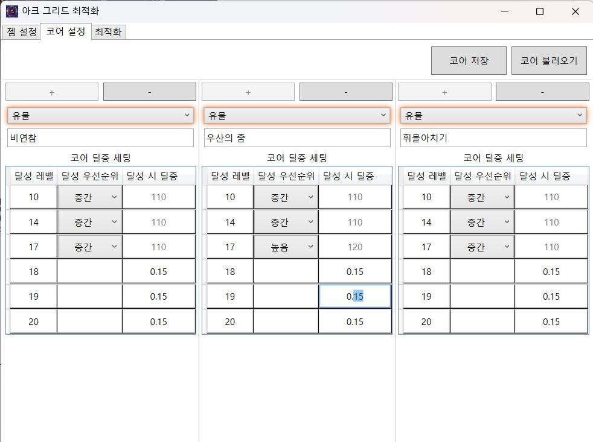
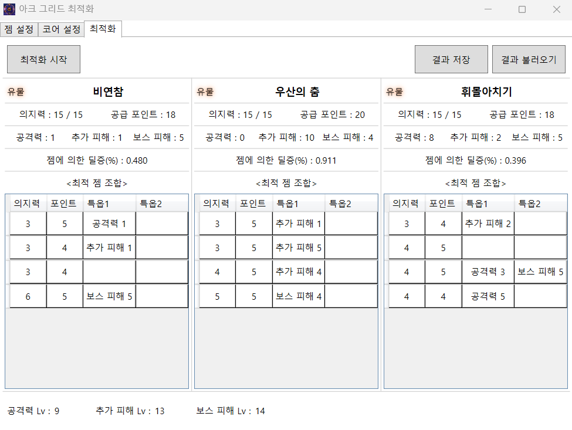

# ArcGrid Optimizer 

로스트아크 아크그리드 최적 젬 배치 탐색기  
제약 프로그래밍(CP)로 모델링하여 복합적 우선순위 반영.

다 만들고 나서야 프로젝트명이 Ark가 아닌 Arc임을 알아챘는데,   
WPF는 프로젝트 이름 바꾸는게 번거로워서 그냥 냅뒀다.

**이슈나 PR은 받으나 기본적으로 유지보수는 하지 않을 예정이므로,  
수정 사항이 있을 경우 직접 포크 떠서 고쳐 쓰시길 권장.**

## 1. 개요

로스트아크에는 아크그리드라는 스펙업 시스템이 있다. 
젬과, 젬이 장착되는 코어의 조합으로 구성되는 이 시스템은 다음 요소를 가지고 있다. 
- **젬** : 각 젬마다 소모 의지력(3~10), 공급 포인트(0~5), 특옵 2개(공%, 보스피해, 추가피해, 또는 없을 수도 있음.) 을 가진다. 
- **코어** : 의지력(10~17), 장착된 젬의 포인트 합계가 특정 단계를 넘을 시 보너스 효과

기존의 다양한 아크그리드 젬 배치 솔버 코드를 확인해 본 결과, 전부 이 문제를 조합론적으로 풀었다.  
물론 대부분 완전 탐색으로 최적해를 찾아내긴 하나 이하의 단점이 있어 이 프로젝트를 시작하게 되었다.
- 각 코어 단계 달성 시 딜 증가량을 반영하기 힘들음
- 특정 코어의 단계 달성 우선순위를 엄밀하게 반영하기 힘들음
- 모든 조합을 뽑은 다음 가치 평가 함수를 통해 정렬하므로, 중간에 알고리즘을 중단시켰을 때 최적값의 상한, 하한을 보장할 수 없음.
- 휴리스틱 논리가 들어가 있음.

코어 단계 달성 시 딜 증가량 반영은 조합 탐색 구현체의 경우 가치 평가 함수만 약간 수정하면 반영 가능하다.  
하지만 조합론적 모델은 전체 조합을 다 찾은 다음부터 시작인데, 진짜로 모든 조합을 다 찾아버리면 탐색공간이 지수적으로 폭발하여 너무 오래걸린다.  
결국 브랜치 컷을 잘 짜서 불가능한 조합을 사전에 걸러내는 작업이 필요한데, 이 과정에서 휴리스틱 논리가 들어오게 된다.
개인적으로 휴리스틱 논리가 들어오면 이후 복잡하고 비직관적인 제약을 반영하기 힘들어서 선호하지 않는다. 

그래서 이 문제를 **정수 제약 프로그래밍(CP)** 문제로 모델링하여, 복잡한 우선순위 논리을 일관된 체계로 다루고 향후 제약 확장에도 용이하도록 했다.
- 각 **코어(Core)** 에 젬(Gem)을 배치하는 것을 이진 변수로 모델링하고,
- **코어 단계(Stage)** 달성 보너스를 극대화하고 **젬의 개별 DPS 가치(Value)** 합을 최대화하도록 목적 함수를 구성하였다.
이후 CP-SAT 솔버에 넣어 돌리면 휴리스틱 논리 없이 원하는 최적화 결과를 뽑아내게 된다.


## 2. 사용법

Relase 빌드의 .exe 파일을 실행하면 끝이다.   
또는 Visual Studio 2022 이상에서 소스코드를 열어 빌드 후 실행.

만약 아직 .NET 8 런타임이 설치되어 있지 않다면, 알아서 최초 시작 시에 다운로드 받게 된다. 
또는 수동으로 마소 공식 페이지 [https://dotnet.microsoft.com/en-us/download/dotnet/8.0](https://dotnet.microsoft.com/en-us/download/dotnet/8.0) 에서 다운로드 후 설치.  

이하 본인 실제 사용 예시 스크린샷들이다. 
### 2-1 젬 설정

젬 설정 탭에서 젬 데이터를 입력한다.
- 젬 데이터는 Json 파일로 저장/불러오기 가능
- 젬 특옵 별 딜 증가량 (%)는 '특옵 설정' 버튼을 눌러 설정 가능. 


저장된 젬 json 파일들의 기본 위치는 `Data/Gem/*` 이다

### 2-2 코어 설정  

코어 설정 탭에서 코어 데이터를 입력한다.
- 각 슬롯의 + 버튼을 눌러 코어를 추가, - 를 눌러 삭제
- 코어 데이터는 Json 파일로 저장/불러오기 가능
- 코어 단계 별 딜 증가량 (%)는 '단계 설정' 버튼을 눌러 설정 가능.
- 코어 특수 단계(10,14,17) 달성 우선순위 조정 가능. (예: 유물 17보다 고대 17의 달성 우선순위를 높이고 싶으면, 유물 코어 $\Delta_{17}=110$ , 고대 코어 $\Delta_{17}=120$)
- 18,19,20 단계 달성 시 딜 증가량 조정 가능 (예: 18단계 달성 시 0.15% 증가 -> 0.15 입력)



### 2-3 최적화 실행

앞의 두 탭에서 젬과 코어 설정을 마쳤다면, 최적화 탭에서 '최적화 시작' 버튼을 눌러 최적화를 시작한다.

- 최적화는 백그라운드 스레드에서 실행되어야 하는데 `귀찮아서 그냥 분리 안했으니 UI가 약간씩 멈춰도 놀라지 말자`.
- 최적화가 완료되면 결과가 바로 갱신된다.
- 최적화 결과 자체를 Json 파일로 저장/불러오기 가능



---

## 3. 최적화 문제 모델링 (CP-SAT Model Formulation)
### 3-1. 변수 정의

| 기호 | 의미 | 타입 |
|------|------|------|
| $I$ | 코어의 집합 | $\\{1,\dots,N_{core}\\}$ |
| $J$ | 젬의 집합 | $\\{1,\dots,N_{gem}\\}$ |
| $K$ | 코어 단계(Level) 구간 | $\\{10,14,17,18,19,20\\}$ |
| $x_{ij}$ | 젬 $j$ 가 코어 $i$ 에 배치되면 1 | Binary, $\\{0,1\\}$ |
| $u_{ik}$ | 코어 $i$ 가 단계 $k$ 달성 시 1 | Binary, $\\{0,1\\}$ |
| $S_i$ | 코어 $i$ 의 총 포인트 합 | $\\{0,\dots,20\\}$ |

---

### 3-2. 입력 파라미터

| 기호 | 의미 |
|------|------|
| $p_j$ | 젬 $j$ 이 제공하는 포인트. 0 ~ 5 |
| $w_j$ | 젬 $j$ 의 의지력 소모량. 3 ~ 10 |
| $v_j$ | 젬 $j$ 의 DPS 가치 총 합 (ATK/추피/보피 합산) |
| $C_i$ | 코어 $i$ 의 의지력 용량. 영웅, 전설, 유물, 고대 등급별로 자동 계산 |
| $\Delta_{ik}$ | 코어 $i$ 가 단계 $k$ 달성 시 증가 DPS%. 젬 설정의 특옵 별 딜증가량 설정에서 변경 가능 |
| $G_{max}$ | 코어당 최대 장착 가능한 젬 수. 여기선 상수 4로 고정 |

---

### 3-3. 제약식

1. **코어 포인트 누적**  
   $i$ 코어의 젬에 의한 누적 포인트  
   $$S_i = \sum_{j \in J} p_j x_{ij}, \quad \forall i \in I$$  
  
2. **젬 슬롯 제한**  
   하나의 코어 당, 최대 $G_{\max}=4$ 개의 젬만 장착 가능.  
   $$\sum_{j \in J} x_{ij} \le G_{\max}, \quad \forall i \in I$$

3. **의지력 용량 제한**  
   코어에 장착된 젬의 소모 의지력 총 합 상한  
   $$\sum_{j \in J} w_j x_{ij} \le C_i, \quad \forall i \in I$$

4. **인벤토리 공유**  
   각 젬은 최대 1개의 코어에만 장착 가능  
   $$\sum_{i \in I} x_{ij} \le 1, \quad \forall j \in J$$

5. **단계 활성화 논리**  
   각 코어 $i$ 에 대해:  
   $$u_{ik} = 1 \Rightarrow S_i \ge k,$$  
   $$u_{ik} = 0 \Rightarrow S_i \le k - 1$$  
   $$\quad \forall i \in I, \forall k \in K$$

   CP-SAT의 `OnlyEnforceIf`를 이용해 구현,  
   위 명제의 대우를 아래 명제의 역으로 만들어서,
   결과적으로 $u_{ik} \Leftrightarrow [S_i \ge k]$ 동치 관계 논리 구현.

6. **단계 누적성**  
   $$u_{i,k_t} \le u_{i,k_{t-1}}, \quad \forall i \in I, \forall t = 2,\dots,|K|$$
   더 높은 단계가 켜지면, 이전 단계도 반드시 켜지도록 제약.

7. **하드 최소 단계 제약 (반영은 안됨)**  
   $i$ 번째 코어의 달성 단계를 강제하는 하드 제약.
   $$S_i \ge T_i^*, \quad \text{(특정 코어에 한해 적용)}$$

   현재는 목적함수에서 코어 단계 보상을 전체 젬의 가치 총량보다 높게 주는 방식으로 구현.  
   다만 어디까지나 소프트 제약이므로 필요시 하드 제약도 고려하면 좋을듯.
   
---

### 3-4. 목적함수 (Maximize)

1. **코어 단계 보상**  
   $$\text{CoreGain} = \sum_{i \in I} \sum_{k \in K} \Delta_{ik} \cdot u_{ik}$$

   이때 특정 단계의 딜 증분, $(\Delta_{i,10}, \Delta_{i,14}, \Delta_{i,17})$ 은 전체 젬 가치 상한보다 큰 값을 부여하여 단계 달성을 강제  
   현재 상중하 3단계(100,110,120)로 설정되어 있으며, 코어 별 단계 달성 우선순위 조정에도 사용.  
   예를 들어 유물 17보다 고대 17의 달성 우선순위를 높이고 싶으면, 유물 코어 $\Delta_{17}=110$ , 고대 코어 $\Delta_{17}=120$

3. **젬 가치 보상**  
   $$\text{GemGain} = \sum_{i \in I} \sum_{j \in J} v_j \cdot x_{ij}$$

4. **최종 목적함수**  
   $$(u^*) = \arg\max_{\substack{u_{i,j}}} \Big( \text{CoreGain} + \text{GemGain} \Big)$$

---

### 3-5. CP-SAT 구현 요약

구글 OR-Tools의 CP-SAT 솔버 사용, C# Wrapper Nuget pkg로 사용.

```csharp
// 단계 활성화 연계 (양방향)
model.Add(S[i] >= k).OnlyEnforceIf(u[(i, k)]);
model.Add(S[i] <= k - 1).OnlyEnforceIf(u[(i, k)].Not());

// 단계 누적성
model.Add(u[(i, K[t])] <= u[(i, K[t-1])]);

// 목적함수
LinearExpr obj = LinearExpr.Sum();
obj += Σ_i Σ_k (Δ[i,k] * u[i,k]);
obj += Σ_i Σ_j (v[j] * x[i,j]);
model.Maximize(obj);
```

자세한 코드는 [ArcGridOptimizer/Models/Opt.cs](./ArcGridOptimizer/Models/Opt.cs) 참고.]


## 4. UI 플랫폼 선정 배경

원래대로면 Qt5를 사용해서 윈도우 <-> 리눅스 크로스 플랫폼 빌드를 지원할 생각이었으나, 
이번 기회에 MVVM 패턴과 WPF에 대해서 공부하기 위해 WPF를 사용해 윈도우만 지원하기로 결정하였다. 

사용된 MVVM nuget pkg는 다음과 같다
- CommunityToolkit.MVVM
- Microsoft.DependencyInjection

덕분에 코드 비하인드를 사용하지 않고, 오로지 XAML 바인딩과 ICommand 인터페이스를 사용해 MVVM을 구현하였다. 

## License

This project is licensed under the MIT License - see the [LICENSE](LICENSE.txt) file for details

## Contact

None

